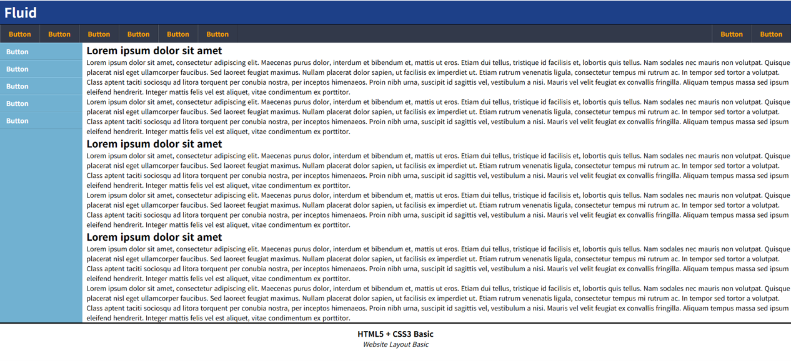

## CSS 작동 원리

### **#main_gnb**

1. `float` 자식 요소를 가진 경우, 부모 요소에 `overflow:hidden` 설정 (책 p. 344)

- 내부 요소가 `float`이므로 해당 요소의 `height`는 0이 됨.
- 따라서 `background-color`를 지정하더라도 색상이 표출되지 않음.
- 이를 해결하기 위해 책에서는 `overflow:hidden` 속성을 줌. (책 p. 228에서 One True Layout 방식이라 명칭)
- `overflow:hidden`은 해당 요소에 [Block Fomartting Context(BFC)](https://developer.mozilla.org/en-US/docs/Web/CSS/CSS_display/Block_formatting_context)를 생성함에 따라 `float` 속성을 가진 자식 요소가 부모 요소의 height 계산에 사용되도록 함.
- `overflow`는 의도치 않은 효과를 발생시킬 수도 있으므로 단순히 BFC를 만드는 것이 목적이라면 `overflow` 보다는 `display:flow-root`가 좋음.

<b>BFC 적용 전후 비교</b>

